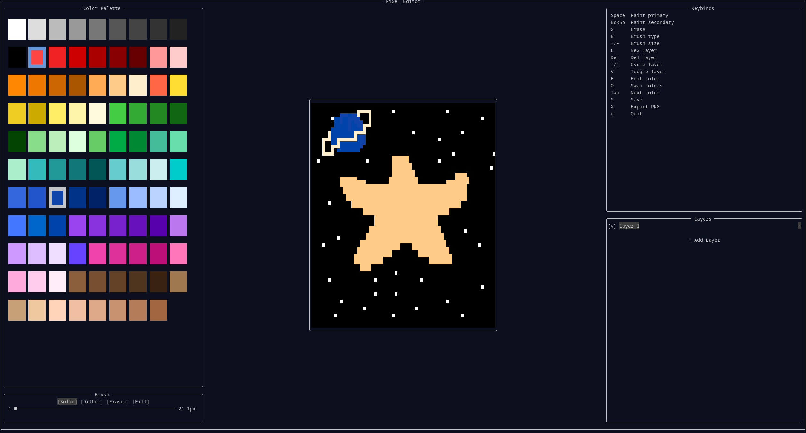

# PIXELSCAPE

Terminal-based pixel art editor. Built with Rust and ratatui.



## Features

- Multi-layer editing with visibility toggles, add/delete/switch
- Brush types: solid, dither (checkerboard blend), eraser, flood fill
- Brush size 1–21px
- 96-color palette with primary/secondary color support and inline RGB editing
- Undo/redo
- Save/load projects (`.pxsc` binary format)
- Export to PNG
- Keyboard and mouse input

## Installation for Users 

Check the releases page and grab the right binary for your OS/arch.

## Build

```
cargo build --release
```

Requires Rust edition 2024.

## Usage

```
cargo run
cargo run -- --file project.pxsc
```

Open a saved project with `--file` to skip the home screen and load directly into the editor.

## Keybindings

| Key | Action |
|---|---|
| Arrow keys | Move cursor |
| G | Jump to bottom of canvas |
| Space | Paint primary color |
| Backspace | Paint secondary color |
| x | Erase (transparent) |
| u / U | Undo / Redo |
| B | Cycle brush type |
| + / - | Increase / decrease brush size |
| q | Swap primary/secondary colors |
| Tab / Shift+Tab | Next / previous palette color |
| E | Edit current palette color (enter R,G,B) |
| S | Save project (.pxsc) |
| X | Export as PNG |
| L | Add new layer |
| Delete | Remove active layer |
| [ / ] | Previous / next layer |
| V | Toggle layer visibility |
| Esc | Cancel input / saving / exporting |
| Q | Quit |

## Project file format

Projects are saved as `.pxsc` files with a `PIXELSCAPE_FILE_FORMAT` magic header followed by bincode-serialized layer data. PNG export flattens visible layers into a single image.

## Cross-compilation

Targets: Linux x86_64, Linux aarch64, Windows x86_64, Windows i686.

```
make x86_64-unknown-linux-gnu
make aarch64-unknown-linux-gnu
make x86_64-pc-windows-gnu
make i686-pc-windows-gnu
```

Prerequisites:
- **Windows targets:** `mingw-w64` (`apt install gcc-mingw-w64` / `dnf install mingw64-gcc mingw32-gcc`)
- **AArch64 target:** `aarch64-linux-gnu-gcc` (`apt install gcc-aarch64-linux-gnu` / `dnf install gcc-aarch64-linux-gnu`)

The AArch64 target uses `aarch64-linker.sh`, which reads two environment variables:

| Variable | Default | Purpose |
|---|---|---|
| `AARCH64_TOOLCHAIN` | `aarch64-linux-gnu` | Cross-compiler prefix |
| `AARCH64_SYSROOT` | *(none)* | Sysroot path (required on Fedora) |

```
# Debian/Ubuntu — compiler's built-in sysroot is correct
make aarch64-unknown-linux-gnu

# Fedora — sysroot is at a non-standard path
make aarch64-unknown-linux-gnu AARCH64_SYSROOT=/usr/aarch64-redhat-linux/sys-root/fc42

# Custom toolchain
make aarch64-unknown-linux-gnu AARCH64_TOOLCHAIN=/opt/toolchains/aarch64-none-linux-gnu/aarch64-none-linux-gnu \
                               AARCH64_SYSROOT=/opt/toolchains/aarch64-none-linux-gnu/sys-root
```
